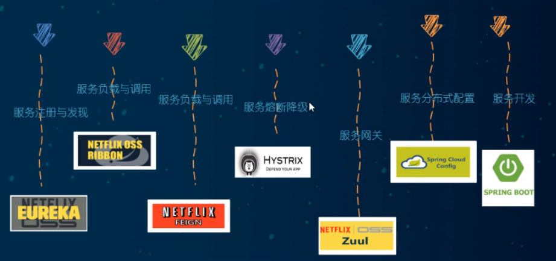

# 分布式
## 1.分布式组件（旧）
  
服务注册与发现--EUREKA    
服务负载--RIBBON  
服务调用--FEIGN  
服务熔断与降级--HYSTRIX  
服务网关--zuul
服务分布式配置--springcloud config  
服务开发--springboot
## 2.分布式组件（新）  
### 2.1服务注册中心
Eureka -- 停止更新（重度患者）    
zookeeper  
consul  
Nacos  -- 推荐  
### 2.2服务负载
Ribbon -- 轻度患者  
LoadBalancer
### 2.3 服务调用
Feign -- 不推荐  
OpenFeign  -- 推荐  
### 2.4服务降级
Hystrix  -- 不推荐
resilience4j -- 国外使用较多  
Alibaba sentinel  -- 国内使用较多  
### 2.5服务网关
zuul -- 不推荐
zuul2 -- 胎死腹中  
gateway -- 推荐
### 2.6服务配置
config --  不推荐
nacos -- 推荐
Apollo
### 2.7服务总线
bus -- 不推荐
nacos -- 推荐

